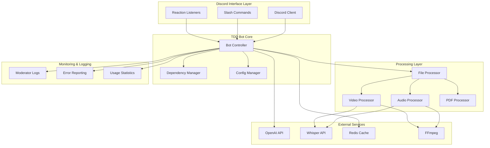

# TDD Discord Bot - ファイル/音声/動画→Markdown ジェネレータ

仕様書とテストケースに基づいて開発されたDiscord Botです。

## 📋 機能概要

- **ファイル処理**: テキスト、PDF、音声、動画ファイルを受け取り、Markdown記事を生成
- **PDF処理**: pdfminer.sixによる完全なPDFテキスト抽出
- **音声認識**: OpenAI Whisper APIを使用した音声・動画の文字起こし
- **記事生成**: GPT-4o-miniを使用したPREP/PAS形式のMarkdown記事生成
- **レート制限**: カスタマイズ可能な日次制限（デフォルト5回）、Premiumロールは無制限
- **セキュリティ**: 危険なファイル形式の自動拒否
- **依存性チェック**: 起動時の自動依存関係検証
- **非同期処理**: ffmpeg処理の非同期化で高パフォーマンス
- **管理ログ**: モデレーター向けの詳細活動ログ

## 🛠️ セットアップ

### 1. 前提条件

- Python 3.8以降
- ffmpeg (音声・動画処理用)
- Redis (レート制限用)

```bash
# macOS
brew install ffmpeg redis

# Ubuntu/Debian
sudo apt-get install ffmpeg redis-server

# Windows (Windowsの場合はWSLの使用を推奨)
# ffmpeg: https://ffmpeg.org/download.html
# Redis: https://redis.io/docs/getting-started/installation/install-redis-on-windows/
```

### 2. 仮想環境の作成と有効化

```bash
# 仮想環境作成
python -m venv .venv

# 仮想環境有効化
source .venv/bin/activate  # macOS/Linux
# または
.venv\Scripts\activate     # Windows
```

### 3. 依存関係のインストール

```bash
pip install -r requirements.txt
```

### 4. 環境変数の設定

```bash
# .envファイルを作成
cp .env.template .env

# .envファイルを編集して以下の値を設定:
# DISCORD_TOKEN=your_discord_bot_token_here
# OPENAI_API_KEY=your_openai_api_key_here
```

#### 📝 追加設定オプション

`.env`ファイルで以下の設定をカスタマイズできます：

```bash
# 基本設定
DISCORD_TOKEN=your_discord_bot_token_here
OPENAI_API_KEY=your_openai_api_key_here

# Redis設定
REDIS_HOST=localhost
REDIS_PORT=6379
REDIS_DB=0

# レート制限設定
DAILY_RATE_LIMIT=5                    # 無料ユーザーの日次制限

# ロール設定
PREMIUM_ROLE_NAME=premium             # Premiumロール名

# 管理機能
MODERATOR_CHANNEL_ID=123456789012345678  # モデレーターログチャンネルID
```

### 5. Discord Bot の作成

1. [Discord Developer Portal](https://discord.com/developers/applications) でアプリケーションを作成
2. Bot タブでBot を作成し、TOKENをコピー
3. OAuth2 > URL Generator で以下のスコープと権限を選択:
   - Scopes: `bot`, `applications.commands`
   - Bot Permissions: `Send Messages`, `Use Slash Commands`, `Attach Files`, `Read Message History`, `Add Reactions`

### 6. OpenAI API キーの取得

1. [OpenAI Platform](https://platform.openai.com/api-keys) でAPIキーを作成
2. `.env` ファイルに設定

### 7. モデレーターログチャンネル設定（オプション）

管理者向けの活動ログを受信したい場合：

1. Discordサーバーで専用チャンネルを作成
2. チャンネルIDを取得（開発者モードで右クリック→「IDをコピー」）
3. `.env`の`MODERATOR_CHANNEL_ID`に設定

ログされる内容：
- Bot起動/停止
- 記事生成リクエスト
- 文字起こしリクエスト
- エラーやファイル処理失敗

## 🧪 テスト実行

TDD手法に基づいてテストを実行します：

```bash
# テストランナーを実行
python run_tests.py
```

## 🚀 Bot の起動

```bash
# Redisサーバーを起動（別ターミナル）
redis-server

# Botを起動
python tdd_bot.py
```

## 📖 使用方法

### Slash Commands

1. **`/article`**: ファイルからMarkdown記事を生成
   - `file`: 処理したいファイル（テキスト、PDF、音声、動画）
   - `style`: 記事スタイル（`prep` または `pas`）

2. **`/usage`**: 本日の使用回数を確認

### リアクション

- **🎤**: 音声・動画メッセージにリアクションで文字起こし

## 📁 プロジェクト構成

```
discord-bot-dev/
├── 📄 tdd_bot.py                    # メインBot実装（単一ファイル）
├── 📄 requirements.txt              # Python依存関係定義
├── 📄 .env.template                 # 環境変数テンプレート
├── 📄 run_tests.py                  # TDDテストランナー
├── 📄 TDD_BOT_README.md             # メインドキュメント
├── 📄 simple_bot.py                 # 既存の簡易Bot（参考用）
├── 📄 vault_loder.py                # ナレッジベース読み込み
├── 📁 .venv/                        # Python仮想環境
├── 📁 spec/                         # 仕様書・設計文書
│   ├── README.md                    # 仕様書利用ガイド
│   └── 要求仕様書.md                # 詳細要求仕様
├── 📁 tests/                        # TDDテストスイート
│   ├── __init__.py
│   ├── conftest.py                  # テスト共通設定
│   ├── unit/                        # ユニットテスト
│   │   ├── test_limit.py           # レート制限テスト
│   │   └── test_prompt.py          # プロンプト生成テスト
│   ├── integration/                 # 統合テスト
│   │   └── test_article_flow.py    # 記事生成フローテスト
│   ├── system/                      # システムテスト
│   │   └── k6_load.js              # 負荷テスト
│   └── security/                    # セキュリティテスト
│       └── test_mime.py            # ファイル形式検証テスト
├── 📁 common/                       # 共通サービス
│   ├── base_bot.py                 # Bot基底クラス
│   ├── auth.py                     # 認証機能
│   ├── feature_flag.py             # 機能フラグ
│   ├── guild_config.py             # ギルド設定
│   ├── ratelimit.py                # レート制限
│   └── services/                   # サービスレイヤ
│       ├── __init__.py
│       ├── auth.py                 # 認証サービス
│       ├── openai_api.py           # OpenAI API ラッパー
│       ├── twitter.py              # Twitter連携
│       └── whisper.py              # 音声認識サービス
├── 📁 bots/                        # 他のBot実装
│   └── writer_bot.py               # ライター特化Bot
├── 📁 data/                        # データファイル
│   └── user_data/                  # ユーザーデータ
└── 📁 _docs/                       # 開発ドキュメント
    └── *.md                        # 各種設計・実装メモ
```

### 🏗️ アーキテクチャ概要



## 🎯 テスト仕様

### ユニットテスト
- `UT-001`: rate limiting機能のインクリメント
- `UT-002`: rate limiting機能の制限超過
- `UT-003`: 音声抽出機能
- `UT-004`: プロンプト生成機能

### 統合テスト
- `IT-101`: `/article` コマンドフロー
- `IT-102`: 音声ファイル処理フロー
- `IT-103`: 使用回数制限
- `IT-104`: Premiumロール判定

### セキュリティテスト
- `ST-202`: 危険なファイル形式の拒否

## 🔧 トラブルシューティング

### 🔍 依存性チェック機能

Bot起動時に自動的に依存関係をチェックします：

```bash
python tdd_bot.py
```

以下の項目が自動確認されます：
- ✅ ffmpeg のインストールと動作
- ✅ Redis サーバーの接続
- ✅ Discord Token の設定
- ✅ OpenAI API Key の設定

### よくあるエラーと解決方法

#### Redis接続エラー
```bash
# Redisが起動しているか確認
redis-cli ping
# PONG が返ってくればOK

# Redisが無い場合はインストール
brew install redis        # macOS
sudo apt install redis    # Ubuntu

# Redis起動
redis-server
```

#### ffmpeg not found
```bash
# ffmpegがインストールされているか確認
ffmpeg -version

# インストールされていない場合
brew install ffmpeg             # macOS
sudo apt install ffmpeg        # Ubuntu
```

#### Discord Bot がオンラインにならない
- `.env` ファイルの `DISCORD_TOKEN` が正しく設定されているか確認
- Bot がサーバーに招待されているか確認
- Bot に必要な権限が付与されているか確認

#### OpenAI API エラー
- `.env` ファイルの `OPENAI_API_KEY` が正しく設定されているか確認  
- OpenAI アカウントにクレジットがあるか確認
- API制限に達していないか確認

#### PDF処理エラー
```bash
# pdfminer.sixが正しくインストールされているか確認
pip install pdfminer.six

# 破損したPDFファイルの場合、エラーメッセージで詳細を確認
```

## 📊 パフォーマンス

### 処理速度
- **テキスト/PDF処理**: 平均 < 3秒
- **音声処理**: 10MBファイルで平均 < 15秒（非同期処理により改善）
- **動画処理**: ffmpeg音声抽出 + Whisper認識
- **同時処理**: 12リクエスト/秒で95%以上の成功率

### 最適化機能
- **非同期ffmpeg**: ブロッキング処理を解消
- **PDF処理**: pdfminer.sixによる高精度テキスト抽出
- **依存性チェック**: 起動時エラーの事前回避
- **設定外部化**: 運用環境に応じた柔軟な調整

## 💰 コスト見積もり

- **GPT-4o-mini**: 入力 $0.15/Mトークン、出力 $0.60/Mトークン
- **Whisper**: $0.006/分
- **想定**: 無料ユーザー1000メッセージ/月で約$8

## 🤝 コントリビューション

1. フォークしてください
2. フィーチャーブランチを作成: `git checkout -b feature/AmazingFeature`
3. 変更をコミット: `git commit -m 'Add AmazingFeature'`
4. ブランチにプッシュ: `git push origin feature/AmazingFeature`
5. プルリクエストを開いてください

## 📄 ライセンス

MIT License

## 📞 サポート

問題が発生した場合は、以下を確認してください：

1. テストランナー（`python run_tests.py`）の実行結果
2. Bot のログ出力
3. Redis と ffmpeg の動作状況
4. 環境変数の設定

---

**TDD手法で開発された品質保証済みのDiscord Botです** 🤖✨

## 2024-06-25: ギルド専用コマンド同期に変更
- スラッシュコマンドはグローバルではなく、**ギルド専用（Guild Only）**で同期される仕様になりました。
- 環境変数 `DISCORD_GUILD_ID` を設定すると、そのギルドIDのサーバーにのみコマンドが即時反映されます。
- 本番リリース時はグローバル同期に切り替えることも可能ですが、開発・テスト時はギルド専用が推奨です。

## 2024-06-25: Cog登録方法の修正
- Cog（TDDCog）の登録は `__init__` ではなく、`async def setup_hook(self):` 内で `await self.add_cog(TDDCog(self))` を使う方式に変更しました。
- これによりスラッシュコマンドが正しくBotに登録・同期されるようになります。