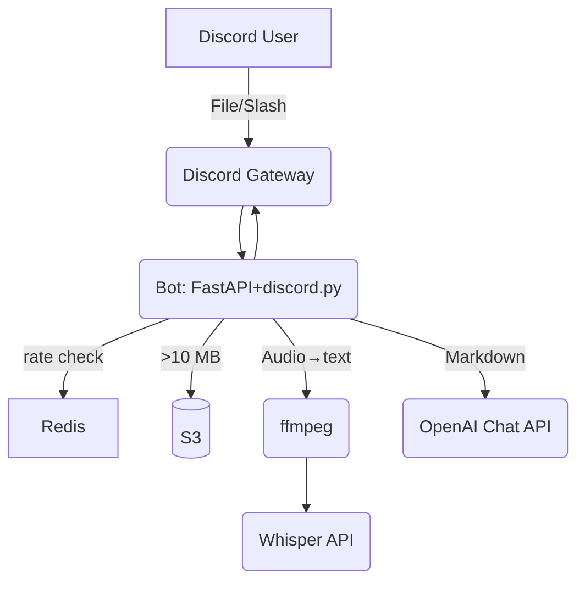

# フリー版 Discord Bot（ファイル／音声／動画→Markdown ジェネレータ）要求仕様書

---

## 概要
- Discordにドラッグ＆ドロップされたテキスト／PDF／音声／動画を解析し、GPT-4o-miniでMarkdown記事を生成・添付するBot。
- ユーザーごとに1日5回まで無料利用可能。Premiumロールは無制限。
- 技術：discord.py 2.x、OpenAI Chat/Whisper API、ffmpeg、boto3 presigned URL、Redis。
- テスト：pytest＋moto＋fakeredisで完全オフライン実行。

---

## 1. ユースケース
| ID    | ユースケース         | アクター         | 正常シナリオ                                                                 |
|-------|----------------------|------------------|-------------------------------------------------------------------------------|
| UC-1  | ファイル投稿→記事生成 | Discordユーザー  | ①添付 or 返信 /article → ②Botが内容取得→③GPT-4o-miniへ送信→④Markdownファイル添付 |
| UC-2  | 音声/動画投稿→記事生成 | Discordユーザー  | ①添付→②ffmpegで音声抽出→③Whisper文字起こし→④UC-1処理へ合流                     |
| UC-3  | 利用回数チェック      | Bot              | ①RedisにINCRヒット→②キーTTL=当日23:59:59→③閾値超過でエラーEmbed                |

---

## 2. インターフェース
| コマンド/リアクション | 入力                | 出力                        |
|----------------------|---------------------|-----------------------------|
| /article (slash)     | style=prep/pas      | 生成記事.md添付（S3 presigned）|
| 🎤リアクション         | 音声・動画メッセージ | Whisper文字起こし.txt添付    |
| /usage (slash)       | –                   | 本日残り回数表示             |

---

## 3. 入力仕様
| 種類   | 拡張子                | Discord無料上限 | 備考                       |
|--------|-----------------------|-----------------|----------------------------|
| テキスト | .txt .md .pdf         | 10MB/msg        | PDF→pdfminer.six           |
| 音声    | .mp3 .wav .m4a .ogg   | 10MB            | サイズ超過は415エラー       |
| 動画    | .mp4 .webm            | 10MB            | ffmpegで音声抽出            |

---

## 4. 出力仕様
- Markdown PREPテンプレ

```
# Point
**…**

## Reason
…

## Example
…

## Point (repeat)
```

- 添付方法
  1. 10MB未満→Discord直接添付
  2. 10MB以上→S3 presigned URL（24h有効）

---

## 5. レート制限
| Key                        | 値   | 実装                       |
|----------------------------|------|----------------------------|
| limit:<discord_id>:<日付>  | 0-5  | Redis INCR + EXPIRE 24h    |

- Premiumロール（@Premium）はチェックをスキップ。DiscordロールAPIで判定。

---

## 6. 非機能要件
| 項目      | 指標                        | 根拠・備考                       |
|-----------|-----------------------------|-----------------------------------|
| レイテンシ | 文章のみ<3s／音声10MB<15s   | Whisperベンチ1min≒40MB           |
| 可用性    | 99%（月間）                 | Fly.io/Hobby VM実績               |
| コスト    | 無料ユーザー1k msg/月≈$8    | GPT-4o-mini単価0.15$/1M in tok    |

---

## 7. アーキテクチャ

- discord.py: 添付取得・slash実装
- Redis: ユーザー日次カウンタ&TTL
- OpenAI: GPT-4o-mini/Whisper API

---

## 8. 開発ステップ & マイルストーン
| WBS | タスク                  | 完了条件           |
|-----|-------------------------|--------------------|
| 1   | limit_user()実装&UT通過 | Redis TTL=OK       |
| 2   | /articleコマンド実装    | IT-101 Pass        |
| 3   | ffmpeg+Whisperラッパ    | IT-102 Pass        |
| 4   | 残回数超過ハンドラ      | IT-103 Pass        |
| 5   | Premiumロール判定       | IT-104 Pass        |
| 6   | S3 presigned upload     | Manual ✓           |
| 7   | Load/Securityテスト     | ST-201/202 ≥ Gate  |

---

## 9. 備考
- Discord無料添付上限は10MB（Nitroで100MB）—大きいファイルはS3経由に自動切替
- Slashコマンドにファイル添付はInteractionオブジェクトのattachments配列で取得可
- OpenAI Whisper文字起こしはaudio/mp3等でaudio.whisper-1を呼ぶ、料金0.006$/min
- GPT-4o-miniは入力0.15$/Mtok、出力0.60$/Mtok—経済的 